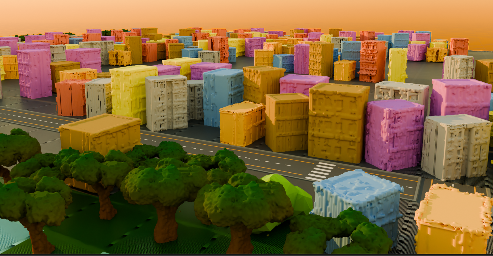

# Generování 3D prostředí pomocí GAN

Tento projekt vznikl v rámci diplomové práce a zabývá se generováním trojrozměrného prostředí pomocí metod strojového učení, konkrétně generativních adversariálních sítí (GAN). Cílem je automaticky vygenerovat věrohodné 3D modely objektů určitého stylu (v práci zvolen low-poly styl) a následně z nich sestavit ucelenou 3D scénu představující celé prostředí. Součástí řešení je také generování 2D mapy (rozmístění objektů v ploše), podle které se objekty rozmístí do scény. Projekt rovněž definuje a využívá kvantitativní metriky k hodnocení kvality generovaných modelů a scén, které posuzují věrnost tvaru a rozmanitost oproti reálným datům.

Podrobnější testy různých GAN modelů (DCGAN, ProGAN, 3DGAN) včetně vizualizací a výsledků nejsou součástí tohoto repozitáře kvůli jejich velikosti, ale jsou k dispozici na OneDrivu. 

## Struktura repozitáře

- **Dataset** – Obsahuje datasety pro trénování 3D objektů a map.
- **Objects_and_scripts** – Blender soubor, který obsahuje jednotlivé objekty včetně jejich variací a rozsekání.Je zde i skript na generování datasetu rotací modelů kolem jedné osy.
- **Object_generation** – Skripty pro generování 3D struktury objektů.
- **Map_generation** – Skripty pro generování, trénování 2D map a sestavení 3D scény.
- **Evaluation_metrics** – Skripty pro vyhodnocení kvality generovaných modelů.

## Obsah
číselně značím doporučovaný spouštění jednotlivých skriptů.
### Generování 3D objektů (složka: `Object_generation`)

- 1) `WGAN.py`: Trénování 3D WGAN-GP modelu pro generování voxelových 3D objektů.
- 2) `generate_object.py`: Generování nových 3D objektů z natrénovaného modelu -> tedy výsledných vah a export do `.obj` formátu.

Utility:
- `processing_obj.py`: Konverze `.obj` modelů na voxelovou reprezentaci a naopak, úpravy velikosti objektů a padding.
- `colorize_obj.py`: Přidání jednoduchých textur/barev na vygenerované objekty.
- `sparsity.py`: Analýza hustoty voxelových modelů.
- `fill_utils.py`: Vyplnění dutin objektů (pokud zvoleno)

### Generování 3D map (složka: `Map_generation`)

- 1) `osm_to_dataset.py`: Stahuje data z OpenStreetMap (OSM), rasterizuje různé mapové vrstvy (silnice, budovy, vegetace, voda) a vytváří z nich malé dlaždice velikosti 32×32. Tyto dlaždice pak ukládá jako dataset vhodný pro trénink.
- 2) `train_maps.py`: Trénování GAN modelu pro generování 2D mapových podkladů.
- 3) `generate_maps.py`: Vygenerování mapových podkladů z vah trénovací sítě.
- 4) `gridmap_to_obj.py`: Sestavení kompletní 3D scény ze získané mapy a připravených 3D objektů.

### Hodnocení kvality (složka: `Evaluation_metrics`)

- `metrics.py`: Skript pro vyhodnocení kvality generovaných modelů pomocí metrik (Chamferova vzdálenost, EMD, JSD, Coverage, MMD, FID) a vygenerování grafů.

### Podrobně:  
**`metrics.py`**

**Globální parametry:**

- `DATASET_DIR`  
  Nastavení adresy datasetu příslušného zkoumaného objektu (musí sedět s váhami).

- `WEIGHTS_DIR`  
  Adresář, kde se nachází váhy.

- `EPOCHS`  
  Nastavení, jaké váhy chci vyhodnotit, např. `[7500]` nebo `[1200, 2000]`.  
  Při `CHECK_SPECIFIC_WEIGHT=True` se bere pouze první váha.

- `NUM_GENERATED`  
  Počet generovaných snímků – slouží pro FID.

- `VOXEL_GRID_SIZE`  
  Velikost mřížky objektů – měl by souhlasit s modelem.

- `VOXEL_THRESHOLD`  
  Vykreslovací threshold.

- `PN_NUM_POINTS`  
  Počet bodů ze surface point cloudu.

- `IMG_VIEWS`  
  Definují se úhly pohledu pro rendering voxelů, např. `[(30, 30), (30, 120)]`.

- `REAL_IMG_DIR`  
  Adresář, kam se uloží vyrenderované náhledy reálných voxelových objektů pro FID.

- `GEN_IMG_DIR`  
  Adresář, kam se uloží vyrenderované náhledy generovaných voxelových objektů pro FID.

- `PLOT_DIR`  
  Složka pro uložení grafů metrik.

- `CSV_PATH`  
  Cesta a název CSV souboru s výslednou tabulkou.

- `CHECK_SPECIFIC_WEIGHT`  
  `True` – přepnutí pro heatmapy a histogramy pro konkrétní váhu.

**`osm_to_dataset.py`**

**Globální parametry:**

- `LOCATION`  
  Název předdefinované lokality pro OSM dotaz (případně se geokóduje).

- `AUTOSEARCH`  
  Automatické hledání oblasti, kde jsou přítomné všechny vrstvy.

- `AS_LAT`, `AS_LON`  
  Výchozí souřadnice, od kterých se při AUTOSEARCH hledá vhodný výřez.

- `ROAD_CONNECTION`  
  Propojení silničních komponent (A* na mřížce) a ztenčení na „kostru“.

- `BUILDING_SIMPLE`  
  Jednoduché doplnění budov v okolí cest (mimo vodu).

- `RESOLUTION`  
  Rozlišení rastru (šířka/výška výsledné matice tříd).

- `OUT`  
  Cesta a název TXT souboru s uloženou maticí mapy.

- `PREVIEW_DIR`  
  Složka pro ukládání náhledových obrázků (vrstvy + mapa tříd).

- `SIZE_KM`  
  Velikost stahované oblasti (čtverec) v kilometrech.

- `DATASET`  
  Přepínač: `True` = generuj dataset (dlaždice), `False` = jednorázový výstup.

- `N_SAMPLES`  
  Cílový počet uložených vzorků (dlaždic) do datasetu.

- `ROTATE`  
  Augmentace rotacemi (násobky 90°): např. `[0,1,2,3]`.

- `FLIP`  
  Augmentace zrcadlením: `"none"`, `"h"` (horizontální), `"v"` (vertikální).

- `TILE_SIZE`  
  Velikost dlaždice (tile) pro dataset (např. 32×32).

- `OFFSET_RATIO`  
  Maximální relativní posun výřezu (bboxu) při generování datasetu.

- `MASTER_PAD`  
  Násobné zvětšení „master“ oblasti pro stažení vrstev (omezení ořezů).

- `DATASET_DIR`  
  Adresář, kam se ukládají `.txt` soubory dlaždic (dataset).

- `TAG_TABLE`  
  Mapování vrstev na číselné třídy (0–4).

- `TARGETS`  
  Požadované procento pokrytí vybraných tříd a jejich tolerance pro výběr dlaždic.

- `ROADS_TAGS`  
  OSM tagy pro výběr silnic (highway…) a přepínač pro railway.

- `VEGETATION_TAGS`  
  Seznam OSM dotazů pro různé typy vegetace.

- `WATER_TAGS`  
  Seznam OSM dotazů pro vodní prvky.

- `locations`  
  Slovník pojmenovaných lokalit a jejich souřadnic - pro možné volání misto geokodu

- `OX_CRS`  
  Použitý souřadnicový referenční systém pro práci s geometrií („EPSG:3857“).

**`train_maps.py`**

**Globální parametry:**

- `DATA_DIRECTORY`  
  Složka se vstupními `*.txt` dlaždicemi.

- `TXT_GLOB`  
  Vzor (glob) pro načítání souborů v datasetu.

- `IMG_SIZE`  
  Rozměr kvartálu po splitu (cílové H×W pro model).

- `NUM_CLASSES`  
  Počet tříd v masce (0–4 → 5 tříd).

- `LATENT_DIM`  
  Dimenze latentního šumu z pro generátor.

- `BATCH_SIZE`  
  Velikost minibatch.

- `EPOCHS`  
  Počet tréninkových epoch.

- `SAVE_EVERY`  
  Perioda ukládání checkpointů a náhledů.

- `LR_G`  
  Learning rate pro generátor.

- `LR_D`  
  Learning rate pro diskriminátor.

- `BETAS`  
  Parametry (β1, β2) pro Adam optimizér.

- `DEVICE`  
  Volba zařízení (CUDA/CPU) dle dostupnosti.

- `CMAP`  
  Paleta (mapování třídy → RGB) pro vizualizaci masek.

**`generate_maps.py`**

**Globální parametry:**

- `LATENT_DIM`  
  Dimenze latentního šumu pro generátor (musí ladit s tréninkem).

- `NUM_CLASSES`  
  Počet tříd v generovaných maskách.

- `DEVICE`  
  Volba zařízení (CUDA/CPU) dle dostupnosti.

- `WEIGHTS_PATH`  
  Cesta k uloženým vahám generátoru.

- `OUTPUT_DIR`  
  Výstupní složka pro generované mapy a náhledy.

- `NUM_MAPS`  
  Počet generovaných map v jedné dávce.

- `DATASET_DIR`  
  Cesta k reálným datům pro srovnávací grid náhledu.

- `CMAP`  
  Paleta (třída → RGB) pro vizualizaci.

**`gridmap_to_obj.py`**

**Globální parametry:**

- `TXT_FILE`  
  Vstupní `.txt` soubor s maticí (mapou tříd), která se převádí do 3D.

- `ASSET_ROOT`  
  Kořenová složka s podsložkami (`buildings/`, `vegetation/`, `water/`, `roads/`, `features/`, `base/`…).

- `OUTPUT_DIR`  
  Cílová složka pro výstupy (`.obj`, zkopírované `.mtl` a textury).

- `OUTPUT_OBJ`  
  Cesta k výslednému slepenému OBJ (např. `output_obj/scene.obj`).

- `CELL_SIZE`  
  Rozměr jedné mřížkové buňky v jednotkách OBJ (škálování assetů).

- `BASE_THICKNESS`  
  Tloušťka základní desky směrem dolů (u „base“ dlaždic).

- `SEED`  
  Seed pro deterministické náhodné volby (`None` = plně náhodné).

- `ASSET_CACHE`  
  Interní cache (prefixy, mapování MTL) pro znovupoužité assety.

- `CATEGORY_MAP`  
  Mapování hodnot v matici → název kategorie, podsložka se 3D modely a barva pro 2D náhled.

  ### Podrobně:  
**`sparsity.py`**

**Globální parametry:**

- `OBJ_DIR`  
  Složka s .obj soubory určenými k analýze zaplněnosti voxelové mřížky.

- `GRID_SIZE`  
  Rozlišení voxelové mřížky (D=H=W), ve které se měří poměr obsazených voxelů.

**`processing_obj.py`**

**Globální parametry:**

- `CACHE_DIR`  
  Adresář pro cache voxelizací (vytvoří se při startu, pokud neexistuje).

**`generate_object.py`**

**Globální parametry:**

- `SAVE_DIR`  
  Výstupní složka pro generované 3D objekty (.obj) a náhledy.

- `weight_path` *(definováno v bloku __main__)*  
  Cesta k souboru s vahami generátoru pro inference.

- `ITERATIONS` *(definováno v bloku __main__)*  
  Počet generovaných objektů v jedné dávce.

**`colorize_obj.py`**

**Globální parametry:**

- `MODE`  
  Režim obarvení: `'solid'` (jednobarevné - obarvuju tak budovy) nebo `'texture'` (vertikální gradient - obarvuju tak stromy).

- `data_dir`  
  Složka s .obj soubory určenými k obarvení.

- `SOLID_RGB`  
  Barva (R,G,B v rozsahu 0–1) pro režim `'solid'`.

- `BROWN_RGB`, `GREEN_RGB`  
  Barvy spodní a horní části vertikální textury (zemina → zeleň).

- `TEX_NAME`  
  Název souboru s generovanou texturou (PNG).

- `TEX_SIZE`  
  Rozlišení generované textury (čtverec size × size).

- `BROWN_PORTION`  
  Podíl výšky (0–1), který má být plně hnědý (spodní pás).

- `GAMMA`  
  Exponent přechodu (tvarování gradientu mezi např. hnědou a zelenou).

**`WGAN.py`**

**Globální parametry:**

- `LATENT_DIM`  
  Dimenze latentního vektoru vstupu generátoru.

- `EPOCHS`  
  Celkový počet tréninkových epoch.

- `BATCH_SIZE`  
  Velikost tréninkové dávky.

- `LR_G`, `LR_D`  
  Learning rate pro generátor a diskriminátor.

- `betas`  
  Párové β parametry pro Adam optimizer.

- `DATA_DIRECTORY`  
  Složka s tréninkovými .obj soubory.

- `CACHE_PATH`  
  Cesta k souboru cache voxelů (urychlení opakovaného tréninku).

- `SAVE_DIR`  
  Složka pro ukládání vah (.pth).

- `EPOCHS_WEIGHT`  
  Perioda (v epochách), po které se ukládají váhy.

- `EPOCHS_VISUALIZATION`  
  Přepínač pro ukládání náhledů voxelových výstupů během tréninku.

- `CRITIC_ITERS`  
  Počet aktualizací diskriminátoru (kritika) na jednu aktualizaci generátoru.

- `LAMBDA_GP`  
  Koeficient pro Gradient Penalty ve WGAN-GP.

- `device`  
  Volba výpočetního zařízení (cuda/cpu).
